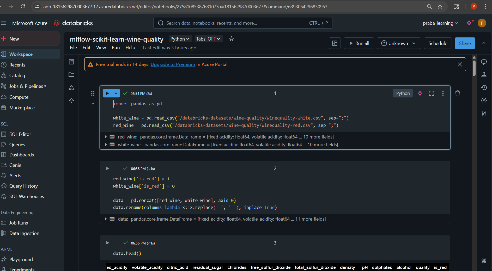

## Databricks MLFlow

### Comparison to local environment :

- Basic setup remains same, we track different experiments, runs and models.
- Model serving seems to be the important additional option. We can quickly make model available to other applications as REST endpoint.
- Better access control, advanced filtering seems to be bonus options.

### My Databricks account :

- First I created free trial version directly from Databricks but it doesn't provide option to create a ML supporting compute engine.
- Then I created a 14 day free trial from my Azure Account which is allowing ML compute engine creation. I guess I will have to pay for those computing service separately at the end of the month.

### My experiment:

I followed the tutorial from https://docs.databricks.com/aws/en/notebooks/source/machine-learning-with-unity-catalog.html

This notebook provides a mlflow example with scikit-learn model. Seems to be very straightforward.

- Data : Wine collection data with features such as alcohol, sulphate, pH, density etc. 
- Preprocessing: The target variable is quality, a numerical variable. Converted it into a binary variable with >7 as high quality. Not much other preprocessing like handling missing, casting data types were required.
- Model: RandomForest classifier from scikit-learn is used.
- MLFlow Recording: I didn't create the experiment prior to the execution, hence it created an experiment with notebook's name.
- Model serving: I didn't try this as it involves additional cost but seems to be an easy option to host a model as REST endpoint.

  
Screenshots:

  

  
