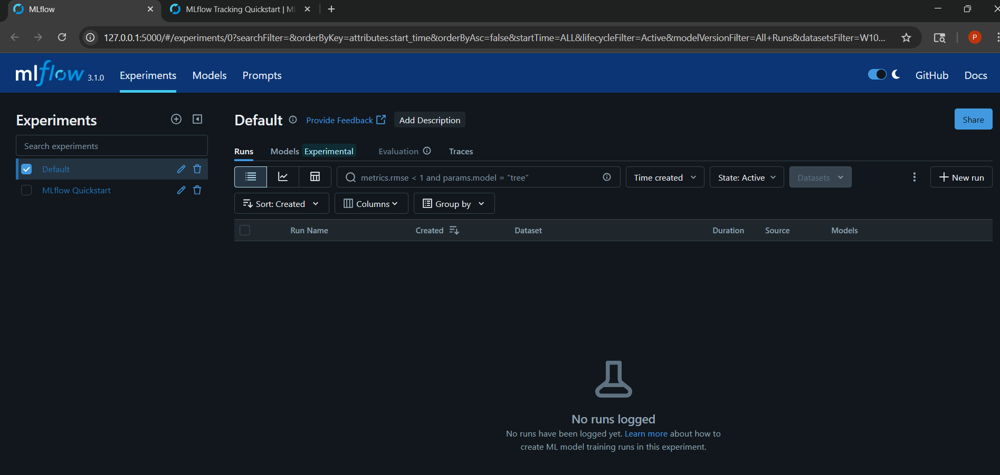
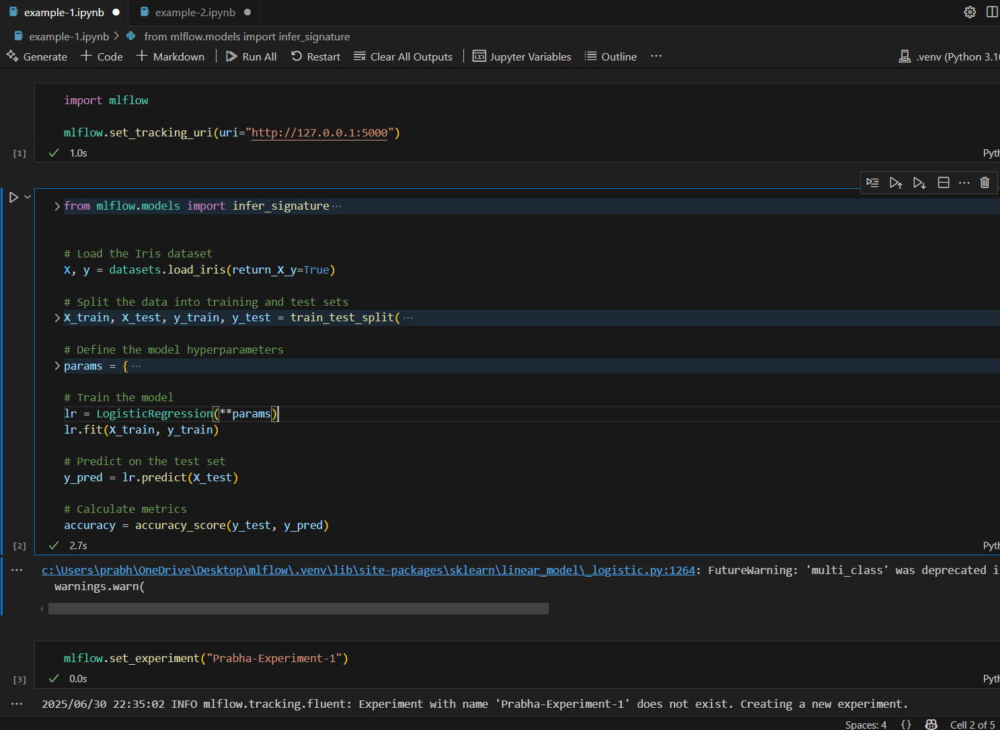
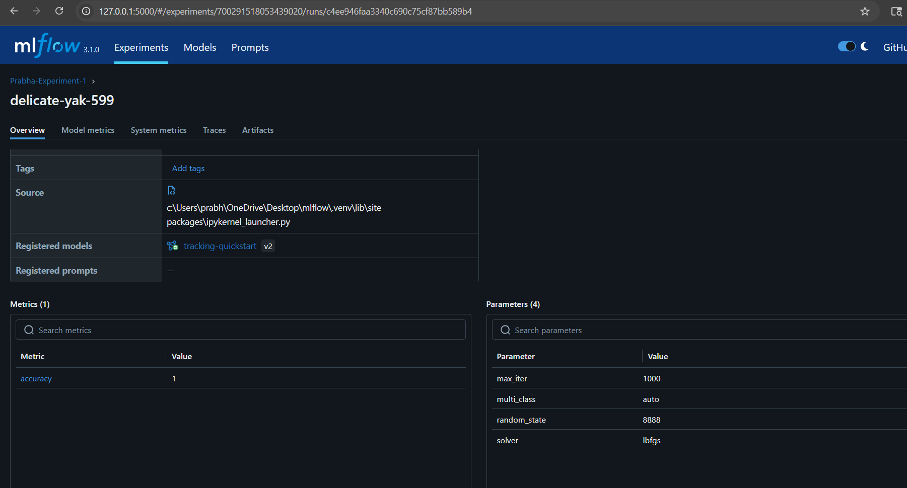

## MLFlow - local environment

Used for learning purpose

- step 1 : Installed mlflow library using pip
- step 2 : Run an ui locally "mlflow.exe ui" - creates light weight server in local and provides an UI
- step 3 : Create a ipython notebook for a machine learning model
- step 4 : Connect to mlflow server
- step 5 : Create an experiment and execute runs. We can either start & end it explicitly or can write "with mlflow.start_run():" block to record the data.

   
Screenshots:

  

  
